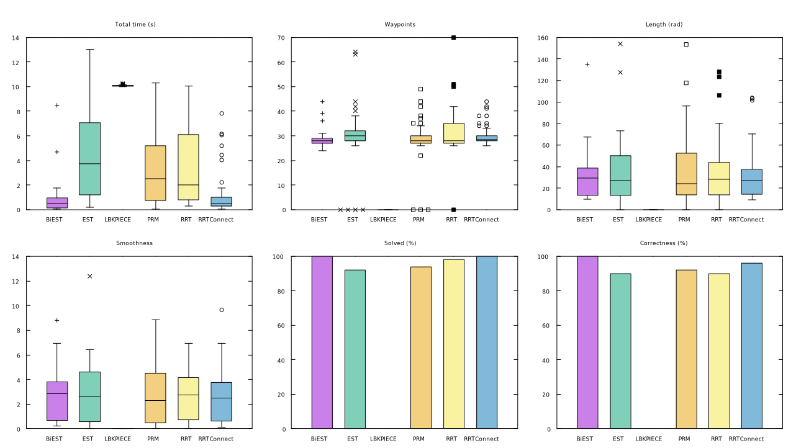

Tutorial
========

You may want to read the documentation

Building a dataset
------------------

Run the motion planning benchmark.

.. code-block:: console

  $ roslaunch moveit_benchmark_suite motion_planning_pp.launch output_file:=tutorial.yaml

  Successfully created dataset: '~/.ros/tutorial.yaml'

Let's look at a sample of the generated dataset. The full dataset is available `here`_.

.. code-block:: yaml

  - dataset:
      name: Tutorial
      type: Motion planning PlanningPipeline
      date: 2022-Mar-16 21:02:02.895584
      uuid: 9c125237_d718_4ed2_bb56_eefc67496841
      hostname: captain-yoshi
      trials: 50
      timelimit: 0
      totaltime: 13371.404078052999

      # Metadata (See full dataset)
      ...

      # Profiler configuration (See full dataset)
      ...

      queries:
        collision_detector: [Bullet, FCL]
        pipeline: [ompl]
        planner: [BiEST, EST, LBKPIECE, PRM, RRT, RRTConnect, RRTstar]
        request: [jc, jc_pcp]
        robot: [panda]
        scene: [empty, mesh, primitive]
      data:
        - query:
            collision_detector: FCL
            pipeline: ompl
            planner: RRTConnect
            request: jc
            robot: panda
            scene: empty
          metrics:
            time: [0.026343238000000001, 0.021277582999999999, 0.022678671000000001, 0.026181673999999999, 0.023225578, 0.028424919, 0.020468185999999999, 0.020203305000000001, 0.025727340000000001, 0.018849355000000002, 0.016784265, 0.020873685999999999, 0.019187050000000001, 0.035856088000000001, 0.024397806000000001, 0.022906345000000002, 0.02609856, 0.040015487000000002, 0.018693574000000001, 0.019917171000000001, 0.023160021999999999, 0.038615022999999998, 0.018648649999999999, 0.020477372000000001, 0.017854363000000002, 0.023638479, 0.01818525, 0.022234598000000001, 0.030117297000000001, 0.020130460999999999, 0.024390037999999999, 0.01975967, 0.021417289999999999, 0.020267354000000001, 0.017261894999999999, 0.019861397999999999, 0.021381774999999999, 0.017933435000000001, 0.020915659, 0.036214863999999999, 0.041835703000000002, 0.043605277999999997, 0.037880724999999997, 0.035054569000000001, 0.024848953, 0.020266444000000002, 0.018776563, 0.01680164, 0.045000723999999999, 0.018857566999999999]
            clearance: [.inf, .inf, .inf, .inf, .inf, .inf, .inf, .inf, .inf, .inf, .inf, .inf, .inf, .inf, .inf, .inf, .inf, .inf, .inf, .inf, .inf, .inf, .inf, .inf, .inf, .inf, .inf, .inf, .inf, .inf, .inf, .inf, .inf, .inf, .inf, .inf, .inf, .inf, .inf, .inf, .inf, .inf, .inf, .inf, .inf, .inf, .inf, .inf, .inf, .inf]
            correct: [1, 1, 1, 1, 1, 1, 1, 1, 1, 1, 1, 1, 1, 1, 1, 1, 1, 1, 1, 1, 1, 1, 1, 1, 1, 1, 1, 1, 1, 1, 1, 1, 1, 1, 1, 1, 1, 1, 1, 1, 1, 1, 1, 1, 1, 1, 1, 1, 1, 1]
            length: [5.5403108999999988, 5.5403109000000006, 5.5403108999999988, 5.5403108999999997, 5.5403109000000006, 5.5403109000000006, 5.5403108999999997, 5.5403109000000015, 5.5403109000000006, 5.5403108999999988, 5.5403108999999988, 5.5403108999999997, 5.5403108999999979, 5.5403108999999988, 5.5403108999999979, 5.5403109000000015, 5.5403109000000015, 5.5403108999999997, 5.5403108999999979, 5.5403108999999997, 5.5403108999999988, 5.5403109000000006, 5.5403108999999997, 5.5403108999999997, 5.5403108999999988, 5.5403108999999997, 5.5403108999999997, 5.5403108999999997, 5.5403108999999988, 5.5403108999999997, 5.5403108999999997, 5.5403108999999979, 5.5403108999999988, 5.5403108999999997, 5.5403108999999979, 5.540310899999997, 5.5403108999999997, 5.5403109000000015, 5.5403108999999997, 5.5403109000000006, 5.5403109000000006, 5.5403109000000015, 5.5403109000000006, 5.5403109000000015, 5.5403109000000015, 5.5403108999999997, 5.5403109000000015, 5.5403108999999997, 5.5403109000000006, 5.5403108999999988]
            smoothness: [6.0903663288809752e-16, 3.2989484240666004e-16, 2.2838873683796735e-16, 7.1054273805491198e-16, 7.866723176318789e-16, 1.2434497922862563e-15, 5.0753052703398406e-16, 1.2180732657761949e-15, 8.6280189522465111e-16, 4.3140094820254478e-16, 1.7763568428367451e-16, 1.3449558943060221e-15, 6.0903663288809752e-16, 1.2688263178761041e-16, 5.329070533111305e-16, 4.5677747373416348e-16, 8.3742536978429351e-16, 6.8516621171953676e-16, 4.567774740195843e-16, 4.0602442192539833e-16, 6.5978968590249728e-16, 7.1054273845679007e-16, 9.3893147411431922e-16, 1.0911906324644969e-15, 3.0451831647316315e-16, 5.0753052743586225e-16, 1.395708949256113e-15, 1.5733446307090791e-15, 5.8366010580719461e-16, 4.5677747196743592e-16, 7.866723176318789e-16, 5.8366010661095108e-16, 1.3703324239574092e-15, 5.0753052703398406e-16, 2.5376526277146434e-17, 2.7914178979413847e-16, 6.597896858442686e-16, 1.4464620026723908e-15, 5.5828358085214029e-16, 3.0451831641493442e-16, 5.8366010666917966e-16, 8.1204884316349766e-16, 7.8667231717177194e-16, 1.3449558964746282e-15, 9.1355494901761093e-16, 3.8064789353787483e-16, 1.9032394709392981e-15, 7.1054273851501885e-16, 5.0753052743586225e-16, 1.8778629479608028e-15]
            success: [1, 1, 1, 1, 1, 1, 1, 1, 1, 1, 1, 1, 1, 1, 1, 1, 1, 1, 1, 1, 1, 1, 1, 1, 1, 1, 1, 1, 1, 1, 1, 1, 1, 1, 1, 1, 1, 1, 1, 1, 1, 1, 1, 1, 1, 1, 1, 1, 1, 1]
            waypoints: [35, 35, 35, 35, 35, 35, 35, 35, 35, 35, 35, 35, 35, 35, 35, 35, 35, 35, 35, 35, 35, 35, 35, 35, 35, 35, 35, 35, 35, 35, 35, 35, 35, 35, 35, 35, 35, 35, 35, 35, 35, 35, 35, 35, 35, 35, 35, 35, 35, 35]
        # Remaining queries (See full dataset)
        - ...

Quick definition and description used in the dataset. These will come in handy in the next sections.

================  =====================================================================================
Node name         Description
================  =====================================================================================
queries           Map of all the pair-wise query combination names used throughout the benchmark. These names were given by the profiler configuration, that means that you can lookup the specific details associated with a query description, e.g. lookup the robot named ``panda`` or the pipeline ``ompl``.
data              Sequence of all the queries benchmarked.
query             Map that represents the current query. It acts as a unique identifier.
metrics           | Map of all metrics computed for this query. The map value is a sequence of data where eqach index represents a trial. If not a sequence and the number of trials is greater then one, then the data is a statistic.
                  | *There is discussions to have a seperate 'statistics' node.*
================  =====================================================================================

This dataset has 84 queries which you can compute by multiplying every number of combinations from the ``queries node``, e.g. 2 :sub:`*` 1 :sub:`*` 7 :sub:`*` 2 :sub:`*` 1 :sub:`*` 3 = 84.

Plotting a dataset
------------------

Let's plot the dataset using GNUPlot. Remember that a dataset can have multiple pair-wise combinations so filtering it is essential to achieve the desired plots. The next sections will show how to plot different graphs.

**Note:** The configurations code blocks below uses YAML syntax and some information may have been left out to favor a cleaner look. If you see ``...``, please refor to the previous configuration/s.

Motion Planning |--| simple
...........................

Let's try to plot this: ``Planner's vs Time``. The plot below isin't what we expected ? Given the number of combinations in the dataset, we see the RRT planner againt 3 different scenes, 2 collision detectors as well as 2 motion plan requests. That gives a total of 12 boxplots per planner!

+--------------------------------+-------------+
| .. code-block:: yaml           |   |plot1|   |
|                                |             |
|    gnuplot_config:             |             |
|      plots:                    |             |
|      - labels:                 |             |
|        - query/planner         |             |
|        metrics:                |             |
|        - name: time            |             |
|          type: boxplot         |             |
|      options:                  |             |
|        terminal: QT            |             |
+--------------------------------+-------------+

We gotta be more specific, let's only use queries that matches these equalities:  ``scene=empty``, ``collision_detector=FCL`` and the ``request=jc`` (short for joint constraint goal). This plots 7 boxplots, well 6 because we filtered the RRTstar planner to have a cleaner graph.

+------------------------------------------+------------------------------------------+
| .. code-block:: yaml                     |                 |plot2|                  |
|                                          |                                          |
|    gnuplot_config:                       |                                          |
|      plots:                              |                                          |
|      - filters:                          |                                          |
|        - ns: query/request               |                                          |
|          val: jc                         |                                          |
|          predicate: "="                  |                                          |
|        - ns: query/collision_detector    |                                          |
|          val: FCL                        |                                          |
|          predicate: "="                  |                                          |
|        - ns: query/scene                 |                                          |
|          val: empty                      |                                          |
|          predicate: "="                  |                                          |
|                                          |                                          |
|        # For better clarity              |                                          |
|        - ns: query/planner               |                                          |
|          val: RRTstar                    |                                          |
|          predicate: "!="                 |                                          |
|        labels:                           |                                          |
|          - query/planner                 |                                          |
|        metrics:                          |                                          |
|        - name: time                      |                                          |
|          type: boxplot                   |                                          |
|      options:                            |                                          |
|        terminal: QT                      |                                          |
|                                          |                                          |
+------------------------------------------+------------------------------------------+

We now want to compare the collision detector FCL against Bullet with the same parameters as above. This will double the previous boxplots because we are adding another collision detector and thus plot 12 boxplots (RRTstar is still filtered**. If this is too much information you can still filter out additionnal planners. Let's use the ``legends** parameter to bring out the comparision even more.

+------------------------------------+------------------------------------+
| .. code-block:: yaml               |              |plot3|               |
|                                    |                                    |
|    gnuplot_config:                 |                                    |
|      plots:                        |                                    |
|      - filters:                    |                                    |
|        ...                         |                                    |
|        legends:                    |                                    |
|          - query/collision_detector|                                    |
|        labels:                     |                                    |
|        - query/planner             |                                    |
|        metrics:                    |                                    |
|        - name: time                |                                    |
|          type: boxplot             |                                    |
|      options:                      |                                    |
|        terminal: QT                |                                    |
|                                    |                                    |
+------------------------------------+------------------------------------+

*You can swap the legends and labels params to have planners as legends and the collision detectors as labels*

To get the full picture, it is often necessary to display several metrics as subplots. If your want to know which of the planners is the fastest in a given scenario, well it's a good idea to compare it against the solved metric, because a planner can be really quick at not solving a goal! Sadly, GNUPlot is not able to automatically resize a multiplot. However, the terminal size is configurable at runtime. You can also use the SVG terminal to somewhat bypass the resize limitation.

+--------------------------------+-------------------------------+
| .. code-block:: yaml           |                               |
|                                |           |plot4|             |
|    gnuplot_config:             |                               |
|      plots:                    |                               |
|      - filters:                |                               |
|        ...                     |                               |
|        labels:                 |                               |
|        - query/planner         |                               |
|        metrics:                |                               |
|        - name: time            |                               |
|          type: boxplot         |                               |
|        - name: waypoints       |                               |
|          type: boxplot         |                               |
|        - name: length          |                               |
|          type: boxplot         |                               |
|        - name: smoothness      |                               |
|          type: boxplot         |                               |
|        - name: avg_success     |                               |
|          type: bargraph        |                               |
|        - name: avg_correct     |                               |
|          type: bargraph        |                               |
|      options:                  |                               |
|        terminal: QT            |                               |
|        size:                   |                               |
|          x: 1280               |                               |
|          y: 720                |                               |
|        n_row: 2                |                               |
|        n_col: 3                |                               |
|                                |                               |
+--------------------------------+-------------------------------+

Motion Planning |--| legend
.............................

.. Declaration of hyperlinks
.. _here: ./dataset.yaml

.. Declaration of unicode dash
.. |--| unicode:: U+2013   .. en dash
.. |---| unicode:: U+2014  .. em dash, trimming surrounding whitespace
   :trim:
