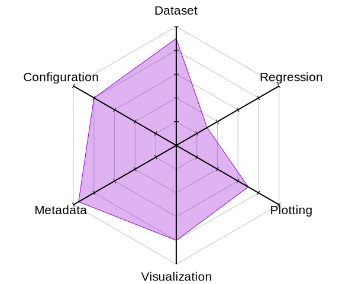

======================
MoveIt Benchmark Suite
======================
**The benchmark suite is under development. The API is unstable and incomplete.**

The benchmark suite is primarily a tool for benchmarking different components of `MoveIt`_. It includes a profiler interface for collecting metrics, a dataset for storing benchmarked data as well as tools to aggregate and plot statistics from datasets.

Overview:

- Plot complex graphs
- Visualize queries
- Regression analysis
- Configure tools at runtime
- Dataset: generic and readable
- Metadata: version control

See the `documentation`_ section for more information.

Packages description
--------------------

benchmark_suite
  MoveIt profilers and benchmark nodes with default configurations.

benchmark_suite_mtc
  MoveIt Task Constructor profilers and benchmark nodes with default configurations.

benchmark_suite_core
  Core library used to create profilers and benchmarks |--| profiler interface, dataset and wrappers around *moveit_core* library.

benchmark_suite_tools
  Log, aggregate and plot statistics from datasets. Visualize queries and results from a profiler with RViz (robot agnostic).

benchmark_suite_resources
  Collection of resources used to configure profilers |--| MoveIt configurations, planning scenes, motion plan requests and more.

urdf_to_scene
  External `package
  <https://github.com/captain-yoshi/urdf_to_scene>`__ to convert a URDF to a PlanningScene.

moveit_serialization
  External `package
  <https://github.com/captain-yoshi/moveit_serialization>`__ that contains YAML serializers for *moveit_msgs* and node manipulation.

Roadmap
-------
- Add GTest
- Clean and document code
- Support Melodic distribution
- Website for ploting datasets. Similar to the `Planner Arena`_

Attribution
-----------
A lot of concepts and code were taken from the `robowflex_library`_ created by Zachary Kingston.

.. Declaration of hyperlinks
.. _documentation: doc/README.md
.. _urdf_to_scene: https://github.com/captain-yoshi/urdf_to_scene
.. _moveit_serialization: https://github.com/captain-yoshi/moveit_serialization
.. _robowflex_library: https://github.com/KavrakiLab/robowflex
.. _MoveIt: https://github.com/ros-planning/moveit
.. _Planner Arena: http://plannerarena.org/

.. Declaration of unicode dash
.. |--| unicode:: U+2013   .. en dash
.. |---| unicode:: U+2014  .. em dash, trimming surrounding whitespace
   :trim:

